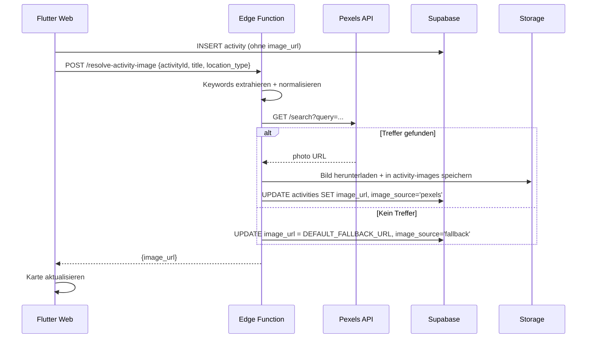

# Circle – Web-App UI-Strategie & Feature-Roadmap

> **Strategischer Fokus:** Web-App First (`flutter run -d chrome`)  
> Mobile Native folgt in einer späteren Phase.  
> **Stand:** v3.0-Planung · 09.07.2026  
> **Bezug:** Cursor-Prompt „UI-Anpassung & Feature-Erweiterung“

---

## 1. Kontext & Strategie

| Aspekt | Entscheidung |
|--------|--------------|
| Produkt | **Circle** – soziales Netzwerk für lokale Aktivitäten |
| Stack | Flutter (Frontend) + Supabase (Backend) |
| **Priorität jetzt** | Desktop-Browser: responsiv, voll funktionsfähig, modernes 3-Spalten-Layout |
| Später | Mobile Apps (iOS/Android) – separates UI-Shell-Konzept |
| Design-Referenz | Screenshots `image_0.jpg` (Feed), `image_1.jpg` (Profil), `image_2.jpg` (Entdecken) |
| MVP-Stand | `VISION.md`, `PROJEKT_VERLAUF.md` (aktuell v2.4) |

### Entwicklungsbefehl (Web)

```bash
flutter run -d chrome \
  --dart-define=SUPABASE_URL=https://xxx.supabase.co \
  --dart-define=SUPABASE_ANON_KEY=dein-key \
  --dart-define=USE_MOCK_LOCATION=true
```

---

## 2. Design-Referenz (Screenshots)

> Die Bilddateien sind im Repo noch nicht abgelegt. Beim Implementieren als `assets/design/image_0.jpg` etc. versionieren.

| Datei | Ansicht | Kern-Elemente |
|-------|---------|---------------|
| `image_0.jpg` | **Feed** | 3-Spalten-Layout, Sidebar, Kategorie-Tabs, Sektionen (Neue Leute / Bekannte / Freunde / Gesponsert), rechte Widgets (Trend, Empfehlungen, Challenges, Freunde online) |
| `image_1.jpg` | **Profil** | Cover-Banner, Avatar-Overlay, Statistiken, Unter-Tabs, rechte Widgets (Level, Challenges, Top-Interessen, Freundesliste) |
| `image_2.jpg` | **Entdecken** | Globaler Header mit Suche, Hero „Erlebnisse verbinden Menschen“, Aktivitäts-Grid |

---

## 3. Teil 1 – UI/UX Web-Anpassung (Höchste Priorität)

### 3.1 Globales Layout: Drei-Spalten-Design

```
┌──────────────┬────────────────────────────┬──────────────┐
│   Sidebar    │     Haupt-Inhalt           │   Widgets    │
│   (~240px)   │     (flex, max ~800px)     │   (~320px)   │
│   fix links  │     zentriert / scroll     │   fix rechts │
└──────────────┴────────────────────────────┴──────────────┘
         + Globaler Header (volle Breite, oben)
```

**Breakpoint-Regeln:**

| Viewport | Verhalten |
|----------|-----------|
| ≥ 1200px | 3 Spalten (Sidebar + Content + Widgets) |
| 900–1199px | Sidebar + Content; Widgets als Drawer / unten |
| < 900px | Einspaltig + Bottom-Nav (später Mobile-Phase) |

**Flutter-Umsetzung (geplant):**

- Neues Shell-Widget: `WebAppShell` ersetzt/erweitert `HomeShell` nur auf Web (`kIsWeb`)
- `LayoutBuilder` + `ResponsiveBreakpoints`
- Getrennte Widgets: `WebSidebar`, `WebHeader`, `WebRightPanel` (route-abhängig)

---

### 3.2 Linke Spalte – Globale Sidebar (`image_0.jpg`)

| Element | Beschreibung | MVP-Ist | Soll |
|---------|--------------|---------|------|
| Logo | „Circle“-Branding oben | ❌ | ✅ |
| Navigation | Menüpunkte | Bottom-Nav (5 Tabs) | Sidebar-Links |
| „Aktivität erstellen“ | Prominenter CTA | Tab „Erstellen“ | Sidebar-Button |
| „Entdecken“ | Discover | Tab „Entdecken“ | ✅ umbenennen |
| „Feed“ | Social Feed | ❌ (nur Discover) | **Neu** – eigene Route |
| „Meine Aktivitäten“ | Hosted Events | Tab „Meine Events“ | ✅ |
| Weitere | Chats, Freunde, Profil, Galerie | verteilt | in Sidebar |
| „Circle Premium“ | Upsell-Banner unten | ❌ | UI-Platzhalter (ohne IAP) |

---

### 3.3 Globaler Web-Header (`image_2.jpg`)

| Element | Beschreibung | MVP-Ist | Soll |
|---------|--------------|---------|------|
| Suchleiste | Global, zentriert | ❌ | Suche nach Aktivitäten + User |
| Notifications | Glocken-Icon | ❌ | Platzhalter / später Push |
| Chat-Icon | Schnellzugriff Chats | nur Tab | Header + Badge (ungelesen) |
| Profil-Dropdown | Avatar + Name („Lena“) | Icon in AppBar | Dropdown: Profil, Einstellungen, Logout |

---

### 3.4 Rechte Spalte – Kontext-Widgets

#### Feed-Ansicht (`image_0.jpg`)

| Widget | Inhalt | Datenquelle (Plan) |
|--------|--------|-------------------|
| Im Trend | Top-Aktivitäten / externe Events | `discover_activities` + Aggregator-Cache |
| Für dich empfohlen | Personalisiert | Interessen + Standort (später ML) |
| Deine Challenges | Fortschrittsbalken | Frontend-Mock → später `challenges`-Tabelle |
| Freunde online | Avatar-Liste | `connections` + Presence (später Realtime) |

#### Profil-Ansicht (`image_1.jpg`)

| Widget | Inhalt | Datenquelle (Plan) |
|--------|--------|-------------------|
| Challenge Level | z. B. „Level 23“ | Mock / `user_stats` |
| Aktive Challenges | Liste mit Fortschritt | Mock / `user_challenges` |
| Top Interessen | Horizontale %-Balken | `profiles.interests` |
| Freundesliste | Kompakte Liste | `get_my_connections` |

---

### 3.5 Mittlere Spalte – Haupt-Inhalte

#### Feed (`image_0.jpg`)

- **Kategorie-Tabs** oben: Outdoor, Sport, Kultur, Social, … (horizontal scroll)
- **Sektionen** mit Überschriften:
  - Neue Leute
  - Bekannte
  - Freunde
  - Gesponsert
- **Aktivitäts-Karten:**
  - Titelbild (User-Upload oder Stock-Fallback)
  - Teilnehmer-Avatar-Stapel
  - Buttons: „Ich bin dabei!“ / „Interessiert“
  - Labels: „Neu“, „Gesponsert“

#### Profil (`image_1.jpg`)

- Cover-Banner (upload oder Default-Gradient)
- Rundes Profilbild als Overlay
- Statistiken: Aktivitäten · Freunde · Gruppen · Bewertung
- Unter-Tabs: Über mich · Aktivitäten · Galerie · Bewertungen

#### Entdecken (`image_2.jpg`)

- Hero: „Erlebnisse verbinden Menschen“ + Suchfeld
- Darunter: responsives **Aktivitäts-Grid** (2–3 Spalten)

---

## 4. Teil 2 – Fehlende MVP- & Design-Features

| Feature | Design sichtbar | MVP-Status | Umsetzungsplan |
|---------|-----------------|------------|----------------|
| **Feed** (eigene Route) | ✅ | ❌ | Neue `FeedScreen`, gruppiert nach `visible_as` |
| **Challenges & Level** | ✅ | ❌ | Phase 2: UI mit Mock-Daten, Phase 3: DB |
| **Challenge-Fortschrittsbalken** | ✅ | ❌ | `ChallengeProgressBar`-Widget |
| **„Neu“-Label** | ✅ grün | ❌ | `created_at > now() - 48h` |
| **Gesponsert-Karten** | ✅ | 🔄 | `is_featured` existiert, Design anpassen |
| **Avatar-Stapel** | ✅ | ❌ | `ParticipantAvatarStack`-Widget |
| **Cover-Banner Profil** | ✅ | ❌ | Spalte `cover_url` in `profiles` |
| **Statistiken Profil** | ✅ | 🔄 | Teilweise (Freunde ja, Gruppen/Bewertung nein) |
| **Circle Premium** | ✅ | ❌ | UI-Banner only |
| **Freunde online** | ✅ | ❌ | Presence / letzter Login |
| **Globale Suche** | ✅ | 🔄 | Freunde-Suche existiert, Aktivitäten fehlt |
| **Stock-Bilder** | implizit | ❌ | Siehe §5A |
| **Externe Events** | „Im Trend“ | ❌ | Siehe §5B |

---

## 5. Teil 3 – Technische Architektur

### 5A – Automatische Stock-Bilder für Aktivitäten

#### Empfohlene API: **Pexels** (Primär), **Unsplash** (Backup)

| API | Vorteile | Nachteile |
|-----|----------|-----------|
| **Pexels** ✅ | Sehr einfache REST-API, großzügiges Free-Tier, klare Attribution, gute Suchqualität | API-Key nötig |
| Unsplash | Bekannte Marke, schöne Bilder | Striktere Rate-Limits, Attribution-Pflicht |
| Pixabay | Kein Attribution-Zwang | Weniger „premium“ Look, schwächere Suche |

**Empfehlung:** Pexels für Produktion; Unsplash als Fallback wenn Pexels 0 Treffer liefert.

> **Wichtig:** API-Keys **niemals** im Flutter-Client. Abruf über **Supabase Edge Function** (`resolve-activity-image`).

#### Keyword-Extraktion aus Titel/Beschreibung

**Stufe 1 – Regelbasiert (MVP, schnell):**

```text
Titel: "Fussball spielen im Park"
→ stopwords entfernen (im, am, und, …)
→ keyword: "fussball park"
→ category-map: fussball → "soccer football"
```

**Stufe 2 – Kategorie-Mapping (bereits im App-Enum):**

| App-Feld | Stock-Query |
|----------|-------------|
| `location_type = outdoor` | + „outdoor“ |
| `location_type = indoor` | + „indoor“ |
| Titel-Keywords | Hauptsuchbegriff |

**Stufe 3 – Optional später:** OpenAI/Claude für 1–3 englische Suchbegriffe aus DE-Titel.

**Beispiel-Mapping-Tabelle** (`activity_image_keywords`):

| DE-Keyword | EN-Search |
|------------|-----------|
| fussball, fußball | soccer football |
| joggen, laufen | running jogging |
| kaffee | coffee cafe |
| wandern | hiking trail |
| gaming | gaming esports |
| konzert | concert music |

#### Workflow (End-to-End)



**Fallback-Kette:**

1. User-Upload (höchste Priorität)
2. Pexels-Suche (Titel-Keywords)
3. Pexels-Suche (nur `location_type`: outdoor/indoor)
4. Statisches Default pro Kategorie (`assets/images/fallback_sport.jpg` …)
5. Globales Default-Bild (`assets/images/fallback_activity.jpg`)

**DB-Erweiterung (Migration `00011` – geplant):**

```sql
ALTER TABLE activities ADD COLUMN image_source TEXT
  CHECK (image_source IN ('user', 'pexels', 'unsplash', 'fallback', 'external'));
```

**Flutter:** Kein direkter API-Call – nur `image_url` aus DB anzeigen. Edge Function wird nach `createActivity` aufgerufen (fire-and-forget oder await).

---

### 5B – Automatische Aggregation externer Aktivitäten

#### Empfohlene APIs / Aggregatoren (Schweiz-Fokus)

| Quelle | Region CH | Kosten | Eignung |
|--------|-----------|--------|---------|
| **PredictHQ** | ✅ global | Paid (Free-Trial) | Festivals, Konzerte, Sport – strukturiert |
| **Ticketmaster Discovery API** | ✅ CH | Partner-Key | Konzerte, Events |
| **Eventbrite API** | ✅ CH | Free-Tier | Community-Events |
| **OpenAgenda** | 🇫🇷/EU | Free | Flohmärkte, Kultur |
| **Switzerland Tourism / lokale APIs** | ✅ | variiert | Tourismus-Events |
| **RSS/ICS Scraping** | lokal | kostenlos | Fallback für kleine Städte |

**Empfehlung MVP:**

1. **Eventbrite** (breit, einfach) + **Ticketmaster** (größere Events)
2. Später: PredictHQ für „Im Trend“-Qualität
3. Edge Function pro Provider, einheitliches internes Format

#### Mapping auf `activities`-Tabelle

Externe Events werden als **eigene Quelle** gespeichert, nicht als Fake-User-Posts:

```sql
-- Migration 00012 (geplant)
ALTER TABLE activities ADD COLUMN source TEXT NOT NULL DEFAULT 'user'
  CHECK (source IN ('user', 'external'));
ALTER TABLE activities ADD COLUMN external_id TEXT;
ALTER TABLE activities ADD COLUMN external_provider TEXT;
ALTER TABLE activities ADD COLUMN external_url TEXT;
CREATE UNIQUE INDEX activities_external_unique
  ON activities (external_provider, external_id)
  WHERE source = 'external';
```

**Transformations-Mapping:**

| Externes Feld | `activities`-Spalte |
|---------------|---------------------|
| title / name | `title` |
| description | `description` |
| start_date | `date_time` |
| lat/lng | `location_geo` |
| venue.name | `location_name` |
| category | `location_type` + Tag |
| image_url | `image_url` |
| — | `host_id` = System-Profil `circle_external_bot` |
| — | `visible_to_strangers = true` |
| — | `source = 'external'` |

**System-Host:** Ein dediziertes Profil `circle_events` (user_type = `company`) als offizieller Aggregator-Host.

#### Cache- & Sync-Strategie (Edge Functions + Cron)

```text
┌─────────────────────────────────────────────────┐
│  Supabase Cron (z. B. alle 6h)                  │
│  → Edge Function: sync-external-events          │
│     1. Eventbrite/Ticketmaster für Region CH    │
│     2. Normalisieren → internes JSON-Schema       │
│     3. UPSERT in activities (external_id)       │
│     4. Alte Events (> 7 Tage) archivieren         │
└─────────────────────────────────────────────────┘
```

| Aspekt | Strategie |
|--------|-----------|
| **Kein Live-Call pro User** | Daten immer aus Postgres-Cache lesen |
| **Refresh-Intervall** | 6h für Events, 24h für Trend-Scores |
| **Region** | PostGIS: `ST_DWithin` um User-Standort / PLZ |
| **Rate-Limits** | API-Keys nur in Edge Functions, zentral gecacht |
| **Fehler** | Letzter guter Cache bleibt aktiv |

**Zusatz-Tabelle (optional):**

```sql
CREATE TABLE external_event_sync_log (
  id UUID PRIMARY KEY DEFAULT gen_random_uuid(),
  provider TEXT,
  synced_at TIMESTAMPTZ,
  events_added INT,
  events_updated INT,
  errors JSONB
);
```

#### UI-Kennzeichnung externer Events

Dezent, aber klar unterscheidbar:

| Element | Umsetzung |
|---------|-----------|
| Badge | „Von [Anbieter]“ oder „Automatisch gefunden“ |
| Icon | `Icons.public` oder `Icons.auto_awesome` |
| Karten-Stil | Leicht anderer Rahmen (gestrichelt / dezente Farbe) |
| Interaktion | Kein „Ich bin dabei“ – stattdessen **„Zur Quelle“** (öffnet `external_url`) |
| Filter | Toggle: „Nur Community-Aktivitäten“ / „Inkl. Events aus dem Web“ |

Beispiel-Badge-Text: `Automatisch · Eventbrite` in `bodySmall`, grau.

---

## 6. Ist vs. Soll – Gap-Analyse (aktueller Code)

| Bereich | Aktuell (`lib/`) | Ziel |
|---------|------------------|------|
| Navigation | `HomeShell` + Bottom-Nav | `WebAppShell` + Sidebar |
| Layout | Einspaltig, mobile-first | 3-Spalten Desktop |
| Feed | `DiscoverFeedScreen` (eine Liste) | Eigener Feed mit Sektionen |
| Profil | Basis-Profil ohne Cover | Cover + Stats + Tabs |
| Entdecken | Filter-Bar + Liste | Hero + Grid |
| Challenges | nicht vorhanden | Mock-UI → DB |
| Stock-Bilder | nur User-Upload | Edge Function + Fallback |
| Externe Events | nicht vorhanden | Cron + Cache |

**Betroffene Kern-Dateien (für Umbau):**

- `lib/features/home/presentation/screens/home_shell.dart`
- `lib/features/discovery/presentation/screens/discover_feed_screen.dart`
- `lib/features/profile/presentation/screens/`
- Neu: `lib/core/layout/web_app_shell.dart`, `web_sidebar.dart`, `web_header.dart`

---

## 7. Implementierungs-Roadmap (Schritt für Schritt)

### Phase 0 – Dokumentation ✅
- Dieses Dokument (`WEB_UI_STRATEGIE.md`)
- Architektur Teil 3 festgelegt

### Phase 1 – Web-Layout-Grundgerüst ✅ (09.07.2026)
1. `WebLayoutScaffold` – 3-Spalten-Layout (`lib/core/layout/`)
2. `SidebarNavigation` – Logo, Nav, Premium-Banner
3. `WebHeader` – Suche, Notifications, Chat, Profil-Dropdown
4. `WebRightPanel` – Platzhalter-Widgets (Trend, Challenges, …)
5. `HomeShell` – nutzt Web-Layout bei `kIsWeb` + Breite ≥ 900px
6. `FeedScreen` – erste Feed-Route mit Kategorie-Tabs

### Phase 2 – Screen-Redesigns ✅ (09.07.2026)
1. **Entdecken** – Hero + Grid (`image_2.jpg`)
2. **Feed** – neue Route, Sektionen, Kategorie-Tabs (`image_0.jpg`)
3. **Profil** – Cover, Stats, Tabs, rechte Widgets (`image_1.jpg`)

### Phase 3 – Design-Features (Frontend) ✅
1. „Neu“-Badge, Avatar-Stapel, Challenge-Mock-UI
2. Premium-Banner (UI only)
3. Rechte Widget-Panels pro Route

### Phase 4 – Backend-Erweiterungen ✅
1. Edge Function `generate-stock-image` (Pexels → `activities.image_url`)
2. Migration `00011` – `source`, externe Events, Discover v2
3. Migration `00012` – `external_event_sync_log`
4. Edge Function + Cron `sync-external-events`

### Phase 5 – Mobile (später)
- Bottom-Nav-Shell für `< 900px`
- Native-spezifische Patterns

---

## 8. Cursor-Prompt (Original-Referenz)

<details>
<summary>Vollständiger Prompt-Text (eingeklappt)</summary>

**Kontext:** Circle – Flutter + Supabase. Web-App First (`flutter run -d chrome`). Screenshots `image_0.jpg`, `image_1.jpg`, `image_2.jpg` = Ziel-UI. `Product_Vision.md` = MVP-Stand.

**Teil 1 – UI/UX:** 3-Spalten-Layout (Sidebar, Header, rechte Widgets, Hauptinhalt für Feed/Profil/Entdecken).

**Teil 2 – Features:** Challenges, Level, „Neu“-Label, Gesponsert-Logik.

**Teil 3 – Architektur-Fragen:**
- A: Stock-Bilder (API, Keywords, Workflow)
- B: Externe Events (APIs CH, Mapping, Cache, UI-Kennzeichnung)

**Anweisung:** Zuerst Teil 3 beantworten, dann Code für Teil 1.

</details>

---

## 9. Verwandte Dokumentation

| Datei | Inhalt |
|-------|--------|
| `DOKUMENTATION.md` | **Gesamtdokumentation** – alles in einem Dokument |
| `VISION.md` | Produktvision Kurzfassung |
| `PROJEKT_VERLAUF.md` | Chronologie v1.0–v2.4 |
| `APP_DOCUMENTATION.md` | Technische Voll-Doku |
| `supabase/README.md` | DB-Setup |

---

*Erstellt: 09.07.2026 · Phasen 1–4 umgesetzt*
